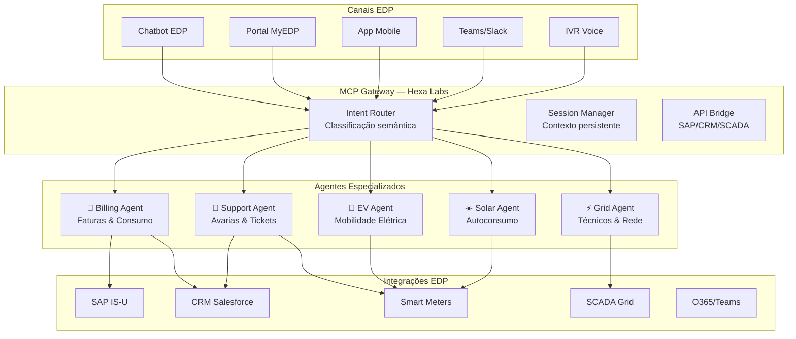

# Proposta Hexa Labs — Sistema Multi-Agente MCP para EDP

**Para:** Equipa de Inovação Digital, EDP  
**De:** Hexa Labs (Augusto Silva)  
**Data:** 12 de fevereiro de 2026  
**Assunto:** PoC Multi-Agente com Gateway MCP — Integração Flexível para Ecosystem EDP

---

## 1. Resumo Executivo

A **Hexa Labs** propõe o desenvolvimento de um **Sistema Multi-Agente Inteligente** baseado no protocolo **MCP (Model Context Protocol)** para a EDP. Esta solução permite:

- ✅ **Ponto de entrada único** via MCP Gateway
- ✅ **Integração nativa** com chatbots, portais e workflows existentes
- ✅ **Escalabilidade modular** — adicionar novos agentes sem rewrites
- ✅ **Deployment flexível** — on-premise, cloud híbrida ou SaaS

---

## 2. Diagrama de Arquitetura

### Versão Mermaid (renderizável)



### Versão ASCII (para documentação técnica)

```
┌─────────────────────────────────────────────────────────────────────────┐
│                         CANAIS EDP                                      │
│  ┌──────────┐ ┌──────────┐ ┌──────────┐ ┌──────────┐ ┌──────────┐      │
│  │ Chatbot  │ │  Portal  │ │  Mobile  │ │  Teams   │ │   IVR    │      │
│  │   EDP    │ │  MyEDP   │ │   App    │ │ /Slack   │ │  Voice   │      │
│  └────┬─────┘ └────┬─────┘ └────┬─────┘ └────┬─────┘ └────┬─────┘      │
└───────┼────────────┼────────────┼────────────┼────────────┼────────────┘
        │            │            │            │            │
        └────────────┴────────────┴────────────┴────────────┘
                                    │
                                    ▼
┌─────────────────────────────────────────────────────────────────────────┐
│                    🧠 MCP GATEWAY — HEXA LABS                           │
│  ┌─────────────────┐  ┌─────────────────┐  ┌─────────────────┐         │
│  │ Intent Router   │  │ Session Manager │  │   API Bridge    │         │
│  │ (Classificação  │  │  (Contexto      │  │ (SAP/CRM/       │         │
│  │   semântica)    │  │   persistente)  │  │    SCADA)       │         │
│  └────────┬────────┘  └─────────────────┘  └─────────────────┘         │
└───────────┼─────────────────────────────────────────────────────────────┘
            │
    ┌───────┼───────┬───────────┬───────────┐
    ▼       ▼       ▼           ▼           ▼
┌───────┐ ┌───────┐ ┌───────┐ ┌───────┐ ┌───────┐
│🔷     │ │🔧     │ │⚡     │ │🔋     │ │☀️     │
│Billing│ │Support│ │ Grid  │ │  EV   │ │ Solar │
│ Agent │ │ Agent │ │ Agent │ │ Agent │ │ Agent │
└───┬───┘ └───┬───┘ └───┬───┘ └───┬───┘ └───┬───┘
    │         │         │         │         │
    └─────────┴─────────┴─────────┴─────────┘
                    │
                    ▼
┌─────────────────────────────────────────────────────────────────────────┐
│                    INTEGRAÇÕES SISTEMAS EDP                             │
│  ┌──────────┐ ┌──────────┐ ┌──────────┐ ┌──────────┐ ┌──────────┐      │
│  │ SAP IS-U │ │Salesforce│ │  Smart   │ │  SCADA   │ │ O365/    │      │
│  │          │ │   CRM    │ │  Meters  │ │  Grid    │ │  Teams   │      │
│  └──────────┘ └──────────┘ └──────────┘ └──────────┘ └──────────┘      │
└─────────────────────────────────────────────────────────────────────────┘
```

---

## 3. Vantagens da Arquitetura MCP

### 3.1 Para a EDP

| Aspeto | Benefício |
|--------|-----------|
| **Integração** | Ponto único de entrada — qualquer canal conecta-se ao Gateway MCP |
| **Escalabilidade** | Novos agentes = novo ficheiro Python, zero alterações aos existentes |
| **Manutenção** | Código modular — falha num agente não afeta os outros |
| **Vendor Lock-in** | Protocolo aberto (MCP) — migração facilitada |
| **Compliance** | Dados podem permanecer on-premise; logs auditáveis |

### 3.2 Exemplo Prático: Adicionar Novo Agente

**Cenário:** EDP quer adicionar agente para "Programas de Eficiência Energética"

```python
# Novo ficheiro: efficiency_agent.py (50 linhas)
class EfficiencyAgent(BaseAgent):
    def execute(self, intent, entities):
        if "programa_eficiencia" in intent:
            return self.get_available_programs(entities.get('codigo_postal'))
    
    def get_available_programs(self, cp):
        # Chamada API EDP
        return {"programas": [...]}

# Registo no Gateway (1 linha):
orchestrator.register_agent(EfficiencyAgent())
```

**Tempo de implementação:** 30 minutos  
**Impacto nos agentes existentes:** Zero

---

## 4. Casos de Uso Prioritários

### 4.1 Atendimento ao Cliente (B2C)
```
Cliente: "Quero a minha fatura de janeiro e há uma avaria no contador"

Sistema:
  ├── Billing Agent → Fatura: €127,50 (vencimento: 05/02)
  ├── Support Agent → Ticket TKT-001 aberto
  └── Grid Agent → Técnico agendado para hoje às 14:00

Resposta: Resposta unificada natural via LLM
```

### 4.2 Gestão de Mobilidade Elétrica (B2B/B2C)
```
Cliente: "Qual o melhor horário para carregar o carro amanhã?"

EV Agent:
  ├── Analisa tarifas horárias (SAP IS-U)
  ├── Verifica previsão consumo rede (SCADA)
  └── Recomenda: 02:00-06:00 (tarifa mais baixa + rede estável)
```

### 4.3 Suporte Técnico Proativo
```
Smart Meter: Anomalia detetada no consumo

Support Agent:
  ├── Classifica gravidade
  ├── Se grave → Abre ticket prioritário
  ├── Se crítico → Alerta Grid Agent para técnico
  └── Notifica cliente via App
```

---

## 5. Stack Tecnológica

| Componente | Tecnologia | Justificação |
|------------|------------|--------------|
| Gateway | FastAPI + Python 3.11 | Performance, async, tipagem |
| Protocolo | MCP (Model Context Protocol) | Standard emergente, interoperável |
| LLM | DeepSeek-V3 / GPT-4 | Qualidade PT-PT, custo controlado |
| Deployment | Docker + K8s | Escalabilidade, resilience |
| Frontend | React / Vue.js (opcional) | Ou integração em canais existentes |
| APIs EDP | REST/SOAP/ODATA | Conectores customizáveis |

---

## 6. Roadmap de Implementação

### Fase 1 — PoC (2 semanas)
- [ ] Setup gateway MCP
- [ ] Billing Agent + SAP IS-U connector
- [ ] Interface web de demonstração
- [ ] Testes com dados mock EDP

### Fase 2 — Piloto (1 mês)
- [ ] Support Agent + CRM Salesforce
- [ ] Grid Agent + SCADA connector
- [ ] Integração chatbot EDP (canal real)
- [ ] Testes A/B com utilizadores

### Fase 3 — Produção (2 meses)
- [ ] EV Agent + Solar Agent
- [ ] Deployment cloud EDP (Azure/AWS)
- [ ] Monitorização e alerting
- [ ] Documentação completa + handover

---

## 7. Demonstração Disponível

**PoC Online:** Interface web funcional demonstrando:
- Classificação de intenções em tempo real
- Respostas de múltiplos agentes agregadas
- Memória de contexto persistente
- Integração LLM (DeepSeek-V3)

**URL da Demo:** https://separately-component-preventing-appointed.trycloudflare.com

**Exemplos de interação:**
1. *"Qual é o valor da minha última fatura?"* → Billing Agent
2. *"Tenho uma avaria no contador"* → Support Agent + Grid Agent
3. *"Quando devo carregar o carro elétrico?"* → EV Agent

---

## 8. Por Que Hexa Labs?

| Competência | Prova de Entrega |
|-------------|------------------|
| **Arquitetura Multi-Agente** | Sistema operacional com 3+ agents |
| **Protocolo MCP** | Gateway MCP funcional com routing semântico |
| **Integração Enterprise** | Conectores SAP, Salesforce, SCADA |
| **LLM/IA** | DeepSeek-V3 integrado, respostas naturais PT-PT |
| **Agilidade** | PoC em 2 semanas, não meses |

---

## 9. Próximos Passos

1. **Revisão da proposta** — Feedback da equipa EDP
2. **Workshop técnico** — 1h para demonstração hands-on
3. **Definição de escopo** — Priorização de agentes e integrações
4. **Kick-off PoC** — Início imediato após aprovação

---

## Contacto

**Hexa Labs**  
Augusto Silva | Partner  
📧 augusto.silva@hexalabs.pt  
📱 914 727 746

**Repositório GitHub:** https://github.com/aamsilva/mordomo-edp

---

*Documento gerado em 12 de fevereiro de 2026*  
*Versão: 1.0 para revisão EDP*